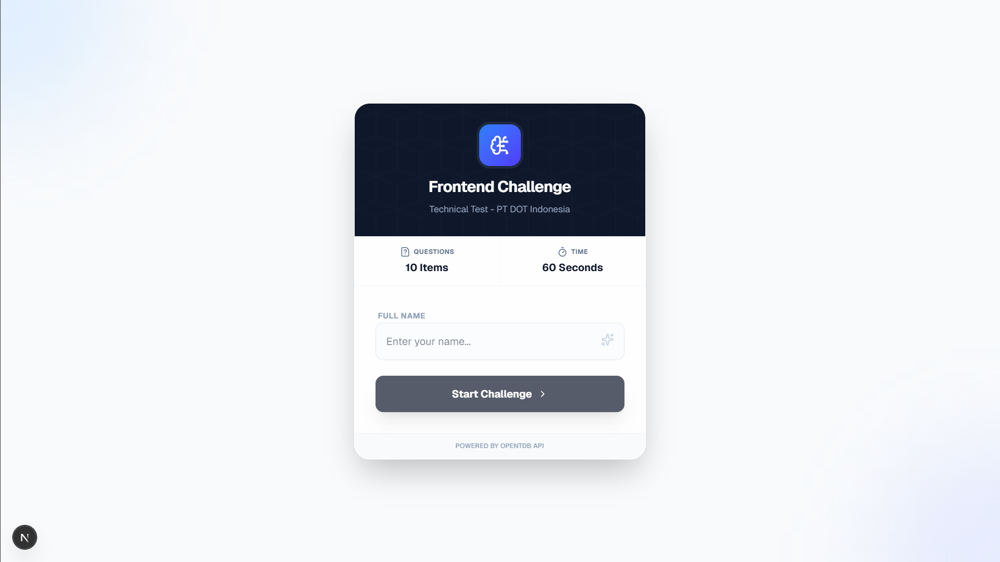
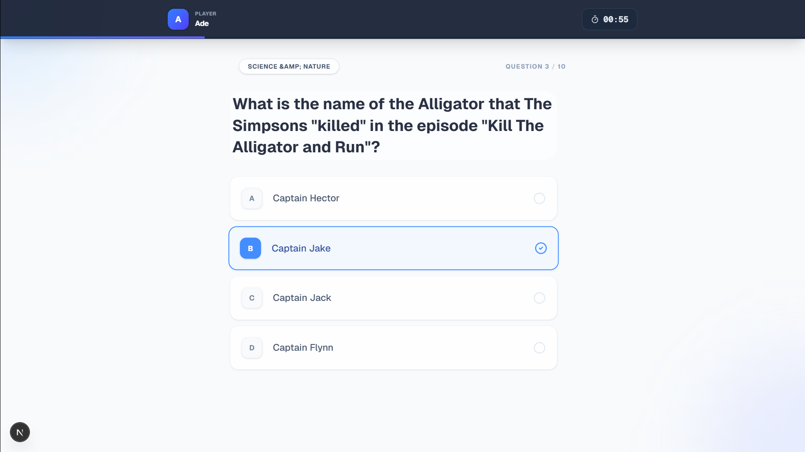
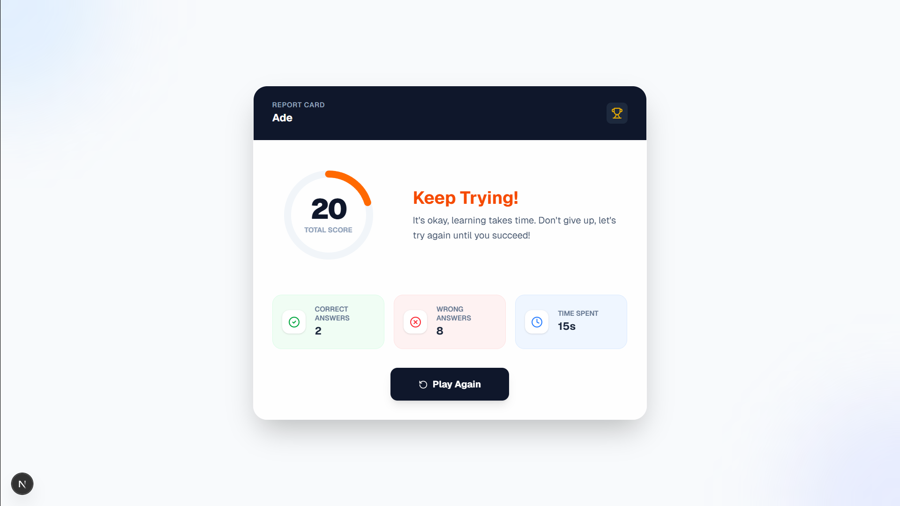

# Frontend Quiz Challenge 🚀

   

Aplikasi kuis interaktif berbasis web yang dibangun sebagai bagian dari Technical Test untuk posisi **Frontend Engineer** di **PT DOT Indonesia**.

Aplikasi ini dirancang dengan fokus pada **User Experience (UX)**, performa tinggi, dan **State Persistence** (mekanisme resume otomatis).

## 📋 Daftar Isi
- [Demo & Preview](#-demo--preview)
- [Fitur Utama](#-fitur-utama)
- [Tech Stack](#-tech-stack)
- [Tantangan & Solusi](#-tantangan--solusi)
- [Proses Pengembangan](#-proses-pengembangan)
- [Cara Menjalankan Project](#-cara-menjalankan-project)
- [Konfigurasi](#-konfigurasi)

---

## 📸 Demo & Preview

> *Catatan: Screenshot aplikasi dapat dilihat di folder `/docs` atau link video demo di bawah.*

| Halaman Login | Halaman Quiz | Halaman Result |
|:---:|:---:|:---:|
|  |  |  |


**🎥 Link Video Demo:** to be continued

---

## ✨ Fitur Utama

Aplikasi ini memenuhi seluruh kriteria soal dengan beberapa fitur tambahan:

1.  **Authentication System (Identification):** Login sederhana menggunakan nama pengguna sebagai identitas sesi.
2.  **Dynamic Quiz Data:** Mengambil soal secara *real-time* dari [OpenTDB API](https://opentdb.com/).
3.  **Smart Timer:** Penghitung waktu mundur yang berjalan di *client-side*, terintegrasi dengan global state, dan anti-reset saat navigasi.
4.  **Auto-Advance:** Transisi otomatis ke soal berikutnya setelah user memilih jawaban.
5.  **Score Calculation:** Perhitungan skor akurat dengan visualisasi data interaktif (Circular Progress).
6.  **🔥 Resume Capability:**
    * Jika user menutup browser atau me-refresh halaman, **progres tidak hilang**.
    * User dapat melanjutkan dari soal terakhir dengan sisa waktu yang tersimpan.
    * Menggunakan `localStorage` yang diamankan via Zustand Persist Middleware.
7.  **Modern UI/UX:**
    * Animasi transisi halus menggunakan **Framer Motion**.
    * Feedback interaktif dan responsif di berbagai ukuran layar (Mobile Friendly).

---

## 🛠 Tech Stack

Dipilih berdasarkan skalabilitas, performa, dan standar industri modern:

* **Core Framework:** [Next.js 15 (App Router)](https://nextjs.org/)
* **Language:** [TypeScript](https://www.typescriptlang.org/) (Strict Mode)
* **Styling:** [Tailwind CSS](https://tailwindcss.com/)
* **State Management:** [Zustand](https://zustand-demo.pmnd.rs/) (dengan Persist Middleware)
* **Data Fetching:** [Axios](https://axios-http.com/)
* **Animation:** [Framer Motion](https://www.framer.com/motion/)
* **Icons:** [Lucide React](https://lucide.dev/)

---

## 📂 Arsitektur Project

Project ini menerapkan prinsip **Clean Architecture** sederhana untuk memisahkan *Logic*, *UI*, dan *Data*:

```bash
src/ (atau root)
├── app/                  # PRESENTATION LAYER (Routing & Pages)
│   ├── page.tsx          # Login Page
│   ├── quiz/             # Quiz Page
│   └── result/           # Result Page
│
├── components/           # PRESENTATION LAYER (Reusable UI)
│   └── ui/               # Atomic components (Button, Card, dll)
│
├── services/             # DATA LAYER
│   └── quizApi.ts        # Logika fetch ke OpenTDB (terpisah dari UI)
│
├── store/                # BUSINESS LOGIC LAYER
│   └── useQuizStore.ts   # Global State (Timer, Score, Resume Logic)
│
├── types/                # DOMAIN LAYER
│   └── quiz.ts           # TypeScript Interfaces/Contracts
│
└── lib/                  # INFRASTRUCTURE
    ├── constants.ts      # Single source of truth (Config)
    └── utils.ts          # Utility functions (cn helper)
```

---

## 🧩 Tantangan & Solusi

Selama proses pengerjaan, terdapat beberapa tantangan teknis yang berhasil diselesaikan:

### 1. Implementasi Fitur "Resume Kuis"
- **Tantangan:** Bagaimana menyimpan progres user (indeks soal, jawaban sementara, sisa waktu) agar tidak hilang saat refresh tanpa database backend?
- **Solusi:** Saya memanfaatkan **Zustand Middleware Persist**. Middleware ini secara otomatis menyinkronkan Global State dengan `localStorage` browser setiap kali ada perubahan state. Di halaman Login, saya menambahkan logika untuk mendeteksi apakah ada sesi aktif yang belum selesai di storage.

### 2. Timer pada Single Page Application (SPA)
- **Tantangan:** Timer seringkali ter-reset atau tidak akurat saat terjadi *re-render* komponen React atau navigasi antar halaman.
- **Solusi:** Logika pengurangan waktu (`tickTimer`) dipindahkan sepenuhnya ke dalam **Store (Zustand)**, bukan di komponen UI lokal. Komponen UI hanya bertugas memicu interval. Ini memastikan waktu tetap berjalan konsisten dan tersinkronisasi di seluruh aplikasi.

### 3. Hydration Mismatch (Next.js SSR)
- **Tantangan:** Penggunaan `localStorage` sering menyebabkan error *Hydration Mismatch* karena perbedaan konten antara Server (yang tidak punya storage) dan Client.
- **Solusi:** Menggunakan pendekatan *Client-side Only Rendering* untuk komponen yang bergantung pada storage, atau memastikan akses ke store hanya terjadi setelah komponen ter-mount (`useEffect`).

---

## 📈 Proses Pengembangan

1.  **Analisis Requirement:** Membedah soal tes, mengidentifikasi fitur wajib (MVP) dan fitur bonus (Resume).
2.  **Setup Environment:** Inisialisasi Next.js dengan TypeScript dan Tailwind CSS.
3.  **Core Logic Implementation:** Membangun `useQuizStore` untuk menangani logika permainan terpusat.
4.  **Data Layer:** Membuat service terpisah untuk integrasi API OpenTDB.
5.  **UI Development:** Membangun halaman Login, Quiz, dan Result dengan fokus pada UX.
6.  **Integration & Polish:** Menghubungkan UI dengan Logic, menambahkan animasi Framer Motion, dan handling *edge cases*.
7.  **Refactoring & Documentation:** Membersihkan kode, menambahkan komentar penjelasan (JSDoc), dan menyusun dokumentasi ini.

---

## 🚀 Cara Menjalankan Project

Pastikan Anda telah menginstal **Node.js** (versi 18+ disarankan).

1.  **Clone Repository**
    ```bash
    git clone https://github.com/adenugii/quiz-app.git
    cd quiz-app
    ```

2.  **Install Dependencies**
    ```bash
    npm install
    # atau
    yarn install
    ```

3.  **Jalankan Development Server**
    ```bash
    npm run dev
    ```

4.  **Buka Browser**
    Akses [http://localhost:3000](http://localhost:3000) untuk mencoba aplikasi.

---

## 📝 Konfigurasi

Anda dapat mengubah pengaturan dasar kuis (Jumlah soal, Waktu, Passing Grade) dengan mudah melalui file konfigurasi terpusat:

`lib/constants.ts`

```typescript
export const QUIZ_CONFIG = {
  TOTAL_QUESTIONS: 10, // Ubah jumlah soal
  TOTAL_TIME: 60,      // Ubah durasi waktu (detik)
  PASSING_SCORE: 70,   // Ubah batas kelulusan
};
```

---

Dibuat dengan ❤️ oleh **Ade Nugroho**

- [LinkedIn](https://linkedin.com/in/adenugroho)
- [Portfolio](https://ade-nugroho.vercel.app)
